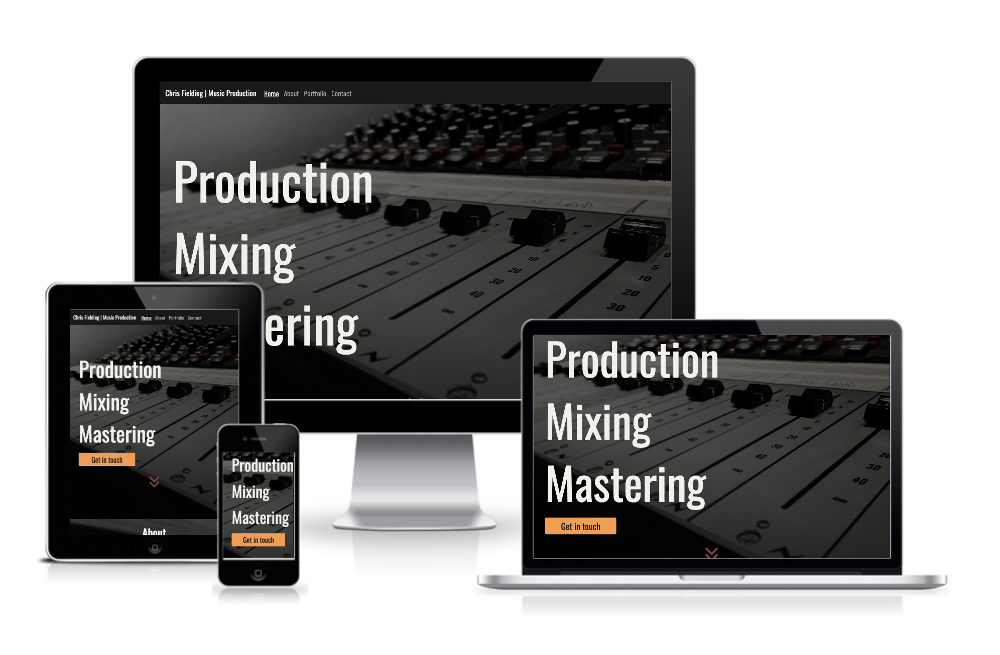

# Chris Fielding Music Producer Website

This is a website for Music Producer Chris Fielding. 
It is built to attract potential clients, who can find out information and get in touch with Chris to work with him.

## Live Site

[View the live project here](https://slfielding.github.io/CI-MS1-Chris-Fielding/index.html#About)

## Repository

[View the repository here](https://github.com/SLFielding/CI-MS1-Chris-Fielding)

***

## Table of Contents
- Overview and Goals
- Design and UX
- Pages
- Features
- Technologies Used
- Validation and Testing
- Deployment
- References

## Overview and Goals
### Project Goals

Chris is in need of a website, which will be the main port and call for new clients. Whilst existing clients are likely to send him an email, new clients should have the opportunity to find out information on Chris and be able to send him an email from the site. Most users visiting the site will be looking to hire Chris for Producing, Mixing or Mastering. Every project has to be priced individually dependent on client specifications, and this is done via email or phone. The site also needs to contain relevant information about Chris, including a bio, portfolio of work, and a link to his discography. 
The site should have intuitive navigation, so that enquiries are able to be submitted to Chris efficiently.  It should also be responsive across multiple well known devices including phone, tablet and desktop.

### Business Goals

The main goal for this website is to increase traffic and enquiries for Chris, which will increase bookings and therefore revenue. 
The website will look professional and this will also contribute to increased bookings and revenue.

### Target Audience

The target audience is bands and musicians of between 20-55 who are looking to record, mix or master an album.

***

## Design and UX

### User Stories

As a user I would like to be able to:

- Understand the purpose of the site upon landing on the homepage
- Navigate to the various pages easily and intuitively
- Be able to contact Chris easily
- Find out about Chris' current work
- Learn about Chris' background
- Be inspired by the imagery
- Find social links easily to follow/contact Chris

## Design

### Colour Scheme

The main monotone pallete has been chosen to symbolise professionalism, while the orange and deep red hark to vintage recording equipment. They are a visual representation of a cosy and inviting space in which clients can relax and give their best performance. They are also representative of the Studio space Chris uses to record and mix. 

### Typography

The paired fonts used in the website are Oswald and Barlow Condensed. These were imported directly into the CSS.

### Imagery

A hero image will be used on the home page which which will  draw the user’s attention and give a strong visual representation of the site's purpose. The image will be of Chris' mixing desk and other periphary equipment. The image will be in black and white.

***

## Wireframes

The Wireframes were made using Balsamiq. The final site does have some differences due to the development process and changes requested by the Client.

Mobile Wireframe [view](/docs/phonewireframe.pdf)

Tablet Wireframe [view](/docs/tabletwireframe.pdf)

Desktop Wireframe [view](/docs/dwireframe.pdf)

***

## Pages

The website has the following pages which are accessible from the Navigation Menu.

- Home / About
- Portfolio
- Contact

and a final page:

- Submit

This page is visible only on submitting the form. It is validation for the user, and also links back to the main pages for quick navigation and to keep the user on the site.

***

## Features

- The Navigation bar is fully responsive and collapses to a "play" icon for mobile devices. The current active page is displayed in white with an underline, to reinforce with the user what page they are currently on.

- The Home / About pages feature on a single scrolling page with links to return to the top navigation. The about page is linked separately in the Nav for easy navigation.

- The Portfolio page features a grid to enable responsivity on several devices and showcase the albums Chris has produced. The albums all link and open new tabs to their information pages on https://www.discogs.com/

- The Contact page form is designed to look like a guitar pedal, which is in keeping with the Design and Goals of the site. It is fully responsive and quick to fill out, to enable users to get in touch easily.

- The Footer features links which open a new page to various social media links, including Chris' spotify showreel.

- The site is fully responsive, featuring flexbox and media queries throughout to appear properly on various devices.

***

## Future Features

- A page featuring Chris' calendar would enable users to see his schedule and earmark dates for working together.

- An embedded Spotify Player on the Portfolio page would enable users to hear Chris' work without navigating to a separate page.

- I would like to add another scrolling page on index.html with a run down of each production / mixing / mastering services

***

## Technologies Used

- [HTML5](https://en.wikipedia.org/wiki/HTML5) provides main content and structure
- [CSS3](https://en.wikipedia.org/wiki/CSS) provides styling
- [Bootstrap 4.6](https://getbootstrap.com/docs/4.6/getting-started/introduction/) provides responsive Navbar
- [Google Fonts](https://fonts.google.com/about) used to import the fonts for the site
- [Font Awesome](https://fontawesome.com/) provides icons
- [Gitpod](https://gitpod.io/workspaces) IDE used to code and host the site
- [Github](https://github.com/) used to deploy the site
- [Photoshop CC 2020](https://www.adobe.com/uk/) used to resize and edit images
- [Balsamiq](https://balsamiq.com/wireframes/) for wireframes
- [Chrome Dev Tools](https://developer.chrome.com/docs/devtools/) used to troubleshoot and test responsivity
- [Am I responsive](https://ui.dev/amiresponsive) used to create a site mockup on various devices

***

## Validation and Testing

For bugs please see the separate testing file [here](TESTING.md)

***

## Deployment

This site is deployed to Github Pages.

The process for deployment is as follows:

1) Navigate to settings on the repository page on Github
2) On the left side of the page, open the Pages tab
3) Under 'branch' select 'main'
4) Click 'save' to the right
5) The page reloads with the deployment info at the top
6) The website is now deployed and can be accessed on various devices.

## Forking

The process of forking is as follows:

1) Log into GitHub and locate the repository
2) On the upper right hand of the page, select fork
3) A copy of the original can now be created and developed

## Cloning

The process of cloning is as follows:

1) Log into GitHub and locate the repository
2) Above the list of files click code
3) Copy the URL for the repository
    - To clone a repository using GitHub CLI, click GitHub CLI
4) Open Gitpod
5) Change the current working directory to where you want the cloned directory to go
6) Type 'git clone' and paste the URL 
7) Hit enter and the clone is created

***

# Credits

- All album images on the Porfolio page are taken from https://www.discogs.com/ a music database with open public contribution.
- Bio image of Chris Fielding is taken by Simon Kallas and approved for free use on the site.
- All other images are taken by me and editied in Photoshop to fit the aesthetic of the site.
- Inspiration for this README came from https://github.com/TashaTJ/pawsome-portraits-v4#key-project-goals

## References

I used a lot of further learning on top of my Code Institute course to build this site from the following: 

- Info on how to change default bootstrap toggler: https://stackoverflow.com/questions/42586729/how-can-i-change-the-bootstrap-4-navbar-button-icon-color

- How to darken an image: https://dev.to/nazanin_ashrafi/how-to-darken-an-image-with-css-4f5h

- CSS Grid Tutorial: https://www.freecodecamp.org/news/how-to-create-an-image-gallery-with-css-grid-e0f0fd666a5c/

- Var functions in CSS tutorial: https://www.w3schools.com/css/css3_variables.asp

- Smooth scroll css: https://www.w3schools.com/howto/howto_css_smooth_scroll.asp#section2

- Code to place image directly on top of the image on Portfolio page: https://www.w3schools.com/howto/howto_css_image_text.asp

