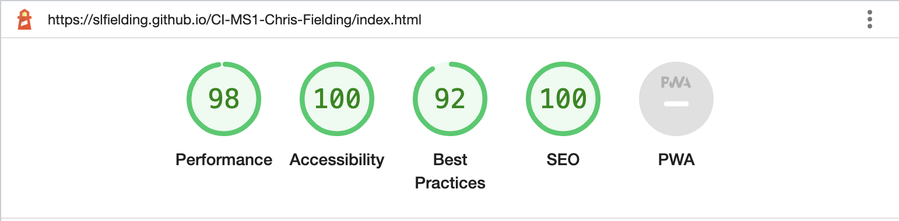
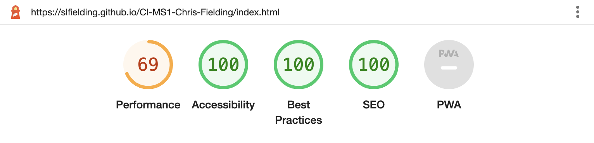
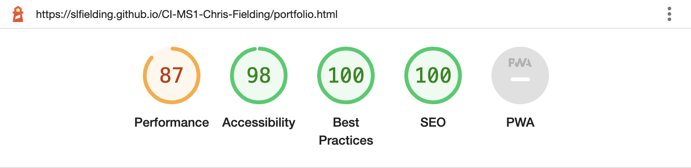
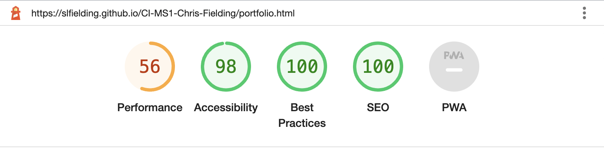
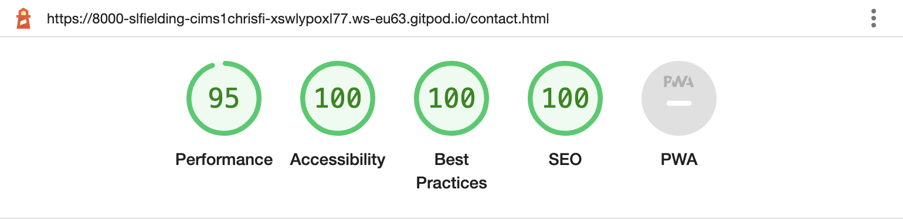
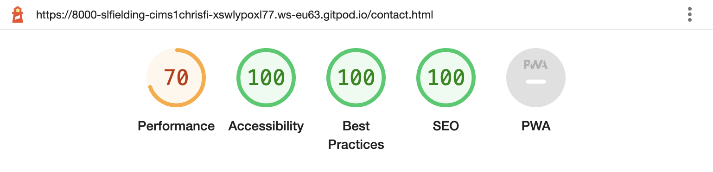
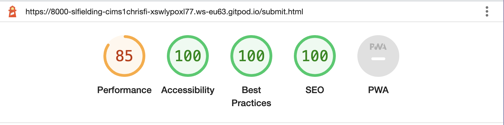
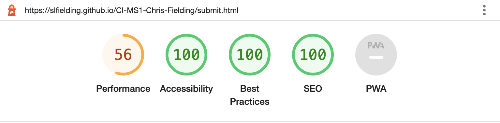
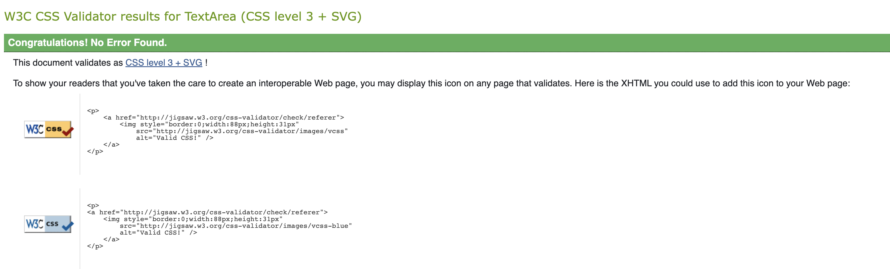
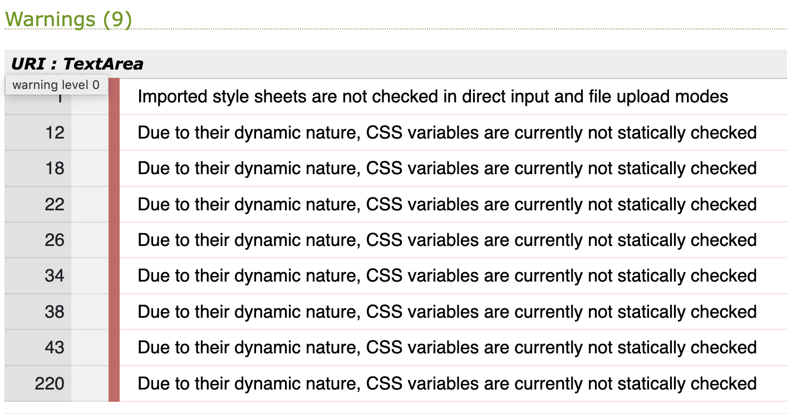

# Testing

## Contents
- [Bugs and Fixes](#bugs-and-fixes)
- [Lighthouse Testing](#lighthouse-testing)
- [Contrast Checker](#contrast-checker)
- [HTML Validator](#html-validator)
- [CSS Validator](#css-validator)

# [Bugs and Fixes](#bugs-and-fixes)

- When testing on different browsers, the portfolio page grid looked streched on Safari and some iPhones. Searching google, I found that this is a common problem with how the browser reads heights in the Grid. The solution was found [here](https://newbedev.com/why-is-css-grid-row-height-different-in-safari) which fixed the issue.


# [Lighthouse Testing](#lighthouse-testing)

## [index.html]

### Desktop index.html
- The index page required accessibilty controls for ARIA - these have all been added.
- Scroll to top #top needed hidden on css and aria controls.
- The images are recommended to be in a next-gen format to speed loading, I have changed these images to webp with mentor Kera Cudmore's advice using www.birme.net and the advice found [here](https://www.stefanjudis.com/snippets/a-picture-element-to-load-correctly-resized-webp-images-in-html/)
- The images have a back up for incompatible browsers.
- The code is as follows:
````
        <picture>
          <source srcset="assets/images/conan-evidence-of-immortality.webp"     alt="conan-evidence of immortality cover" class="image" type="image/webp">
          
        </picture>
````
- 'Image elements do not have explicit width and height' - fixed with advice from [here. ](https://dev.to/grahamthedev/quick-tips-how-to-fix-image-elements-do-not-have-explicit-width-and-height-in-page-speed-insights-lighthouse-3776#:~:text=All%20you%20need%20to%20do,the%20image%20before%20it%20loads.)
Added explicit width inline :
          
        <picture>
          <source srcset="assets/images/chrisfielding1.webp" alt="Chris Fielding playing bass with Conan" type="image/webp" width="601" height="auto">
          
        </picture>

- Final Lighthouse score



### Mobile index.html
- All the above was actioned prior to the mobile testing. The performance is not as high as the desktop, but currently I can do nothing else to imporve this. Recommendations for a higher score include:

      > Reduce unused CSS (bootstrap served currently as minified css in head tag 0.6s)
      > Preconnect to required origins (0.3s)
      > Serve static assets with an efficient cache policy 

- Final Lighthouse score


## portfolio.html

### Desktop portfolio.html
- The page required accessibilty controls for ARIA - these have all been added.
- Scroll to top #top needed hidden on css and aria controls.
- The main image was also recommended to be changed to a next-gen format to speed loading, I have changed these images to webp with mentor Kera Cudmore's advice using www.birme.net and the advice found [here](https://www.stefanjudis.com/snippets/a-picture-element-to-load-correctly-resized-webp-images-in-html/)
The images have a back up for incompatible browsers.
- After loading the .webp images, the error message 'serves images with low resolution' and recommends resizing to 518px x 518px. These were all resized and passed the audit.
- The other recommendation for performance is to "Serve static assets with an efficient cache policy" but for the moment this is outside my area of knowlegde. I can look at this in the future.

- Final Lighthouse score


### Mobile portfolio.html
- All the above was actioned prior to the mobile testing. The performance is not as high as the desktop, but currently I can do nothing else to imporve this. Recommendations for a higher score include:

      > Eliminate render blocking resources (bootstrap served currently as minified css in head tag 0.93s)
      > Reduce unused CSS (bootstrap related) (0.6s)
      > Serve static assets with an efficient cache policy 

- Final Lighthouse score


## contact.html

### Desktop contact.html
- The page required accessibilty controls for ARIA - these have all been added.
- The bg image was also recommended to be changed to a next-gen format to speed loading, I have changed these images to webp with mentor Kera Cudmore's advice using www.birme.net and the advice found [here](https://www.stefanjudis.com/snippets/a-picture-element-to-load-correctly-resized-webp-images-in-html/)
- 'Heading elements are not in a sequentially-descending order' so I changed the sub heading above the radio buttons from h3 to h2 to comply.
- Other recommendations for increased performance:
      > "Serve static assets with an efficient cache policy" but for the moment this is outside my area of knowlegde. I can look at this in the future.
      > > Preconnect to required origins (0.14s)

- Final Lighthouse score


### Mobile contact.html
- All the above was actioned prior to the mobile testing. The performance is not as high as the desktop, but currently I can do nothing else to imporve this. Recommendations for a higher score include:

      > Eliminate render-blocking resources (bootstrap related)(0.71 s)
      > Reduce unused CSS (bootstrap related)(0.3s)
      > Serve static assets with an efficient cache policy 

- Final Lighthouse score


## submit.html

### Desktop submit.html
- The page required accessibilty controls for ARIA - these have all been added.
- The bg image was also recommended to be changed to a next-gen format to speed loading, I have changed these images to webp with mentor Kera Cudmore's advice using www.birme.net and the advice found [here](https://www.stefanjudis.com/snippets/a-picture-element-to-load-correctly-resized-webp-images-in-html/)
- 'Heading elements are not in a sequentially-descending order' so I changed the sub heading above the radio buttons from h3 to h2 to comply.
- Other recommendations for increased performance:
      > "Serve static assets with an efficient cache policy" but for the moment this is outside my area of knowlegde. I can look at this in the future.
      > > Eliminate render blocking resources (bootstrap related)(0.23s)

- Final Lighthouse score


### Mobile submit.html
- All the above was actioned prior to the mobile testing. The performance is not as high as the desktop, but currently I can do nothing else to imporve this. Recommendations for a higher score include:

      > Eliminate render-blocking resources (bootstrap related)(0.54 s)
      > Reduce unused CSS (bootstrap related)(0.45s)
      > Serve static assets with an efficient cache policy 

- Final Lighthouse score


## [Contrast Checker](#contrast-checker)

I used the WCAG Contrast checker which initally had issues with:
- Colours I was using not providing enough contrast
- Button colours (eg orange button with white font) being hard to read
- p elements being too small
- Collapsed Nav being too small

I fixed all these as per the guidelines and the site now passes all the tests up to 'AAA'

## [HTML Validator](#html-validator)

### index.html
- Error: Attribute alt not allowed on element source at this point.
- Error: Bad value auto for attribute height on element source: Expected a digit but saw a instead.
- Error: Attribute type not allowed on element img at this point.
- Error: Bad value auto for attribute height on element img: Expected a digit but saw a instead.

Changed all as per guidelines and now the page passes validation - "Document checking completed. No errors or warnings to show."

### portfolio.html
- Error: Attribute aria not allowed on element a at this point.
- Error: Attribute label not allowed on element a at this point.
- Error: Attribute alt not allowed on element source at this point.
- Error: Attribute type not allowed on element img at this point.

Changed all as per guidelines and now the page passes validation - "Document checking completed. No errors or warnings to show."

### contact.html

The page passes validation - "Document checking completed. No errors or warnings to show."

### submit.html

- Error: The element a must not appear as a descendant of the button element.

Changed the button element and set it in a form as per guidelines and now the page passes validation - "Document checking completed. No errors or warnings to show."

## [CSS Validator](#css-validator)

The styles.css passes all the checks and is validated.
The warnings are related to external style sheets and var(colors) in the root which cannot be validated.



