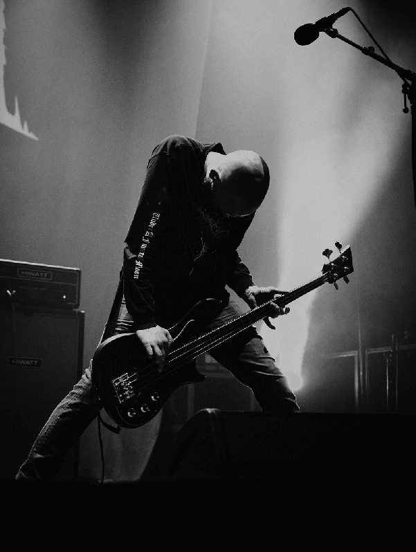

# Testing

## Contents
- [Bugs and Fixes](#bugs-and-fixes)
- [Lighthouse Testing](#lighthouse-testing)
      - [index.html](#index-html)
      - [portfolio.html](#portfolio-html)
      - [contact.html](#contact-html)
      - [submit.html](#submit-html)
- [Contrast Checker](#contrast-checker)
- [HTML Validator](#html-validator)
- [CSS Validator](#css-validator)
- [Responsiveness](#responsiveness)
- [Browser Compatibility](#compatibility)
- [Testing User Stories](user-stories)

# [Bugs and Fixes](#bugs-and-fixes)

- When testing on different browsers, the portfolio page grid looked streched on Safari and some iPhones. Searching google, I found that this is a common problem with how the browser reads heights in the Grid. The solution was found [here](https://newbedev.com/why-is-css-grid-row-height-different-in-safari) which fixed the issue.


- After editing the page as per Lighthouse testing recommendations, I set the image in the About section to have explicit width and height in order to help the image load more efficiently. This in conjunction with the css max-width:100% and max-height:100% causes the image to be streched on mobile. Changing these to width:100% and height:100% seems to have fixed the issue.

- This error above was still persistent after this, so I removed the explicit width and height from inline on the index.html and it seems to be functioning fine now. It may slightly affect the lighthouse score but it is working.

# [Lighthouse Testing](#lighthouse-testing)

## [index.html](#index-html)

***

### Desktop index.html
- The index page required accessibilty controls for ARIA - these have all been added.
- Scroll to top #top needed hidden on css and aria controls.
- The images are recommended to be in a next-gen format to speed loading, I have changed these images to webp with mentor Kera Cudmore's advice using www.birme.net and the advice found [here](https://www.stefanjudis.com/snippets/a-picture-element-to-load-correctly-resized-webp-images-in-html/)
- The images have a back up for incompatible browsers.
- The code is as follows:
````
        <picture>
          <source srcset="assets/images/conan-evidence-of-immortality.webp"     class="image" type="image/webp">
          
        </picture>
````
- 'Image elements do not have explicit width and height' - fixed with advice from [here. ](https://dev.to/grahamthedev/quick-tips-how-to-fix-image-elements-do-not-have-explicit-width-and-height-in-page-speed-insights-lighthouse-3776#:~:text=All%20you%20need%20to%20do,the%20image%20before%20it%20loads.)
Added explicit width inline :
          
        <picture>
          <source srcset="assets/images/chrisfielding1.webp" type="image/webp" width="601" height="auto">
          
        </picture>

- Final Lighthouse score


### Mobile index.html
- All the above was actioned prior to the mobile testing. The performance is not as high as the desktop, but currently I can do nothing else to imporve this. Recommendations for a higher score include:

      > Reduce unused CSS (bootstrap served currently as minified css in head tag 0.6s)
      > Preconnect to required origins (0.3s)
      > Serve static assets with an efficient cache policy 

- Final Lighthouse score


## [portfolio.html](#portfolio-html)

*** 

### Desktop portfolio.html
- The page required accessibilty controls for ARIA - these have all been added.
- Scroll to top #top needed hidden on css and aria controls.
- The main image was also recommended to be changed to a next-gen format to speed loading, I have changed these images to webp with mentor Kera Cudmore's advice using www.birme.net and the advice found [here](https://www.stefanjudis.com/snippets/a-picture-element-to-load-correctly-resized-webp-images-in-html/)
The images have a back up for incompatible browsers.
- After loading the .webp images, the error message 'serves images with low resolution' and recommends resizing to 518px x 518px. These were all resized and passed the audit.
- The other recommendation for performance is to "Serve static assets with an efficient cache policy" but for the moment this is outside my area of knowlegde. I can look at this in the future.

- Final Lighthouse score


### Mobile portfolio.html
- All the above was actioned prior to the mobile testing. The performance is not as high as the desktop, but currently I can do nothing else to imporve this. Recommendations for a higher score include:

      > Eliminate render blocking resources (bootstrap served currently as minified css in head tag 0.93s)
      > Reduce unused CSS (bootstrap related) (0.6s)
      > Serve static assets with an efficient cache policy 

- Final Lighthouse score


## [contact.html](#contact-html)

***

### Desktop contact.html
- The page required accessibilty controls for ARIA - these have all been added.
- The bg image was also recommended to be changed to a next-gen format to speed loading, I have changed these images to webp with mentor Kera Cudmore's advice using www.birme.net and the advice found [here](https://www.stefanjudis.com/snippets/a-picture-element-to-load-correctly-resized-webp-images-in-html/)
- 'Heading elements are not in a sequentially-descending order' so I changed the sub heading above the radio buttons from h3 to h2 to comply.
- Other recommendations for increased performance:
      > "Serve static assets with an efficient cache policy" but for the moment this is outside my area of knowlegde. I can look at this in the future.
      > > Preconnect to required origins (0.14s)

- Final Lighthouse score


### Mobile contact.html
- All the above was actioned prior to the mobile testing. The performance is not as high as the desktop, but currently I can do nothing else to imporve this. Recommendations for a higher score include:

      > Eliminate render-blocking resources (bootstrap related)(0.71 s)
      > Reduce unused CSS (bootstrap related)(0.3s)
      > Serve static assets with an efficient cache policy 

- Final Lighthouse score


## [submit.html](#submit-html)

***

### Desktop submit.html
- The page required accessibilty controls for ARIA - these have all been added.
- The bg image was also recommended to be changed to a next-gen format to speed loading, I have changed these images to webp with mentor Kera Cudmore's advice using www.birme.net and the advice found [here](https://www.stefanjudis.com/snippets/a-picture-element-to-load-correctly-resized-webp-images-in-html/)
- 'Heading elements are not in a sequentially-descending order' so I changed the sub heading above the radio buttons from h3 to h2 to comply.
- Other recommendations for increased performance:
      > "Serve static assets with an efficient cache policy" but for the moment this is outside my area of knowlegde. I can look at this in the future.
      > > Eliminate render blocking resources (bootstrap related)(0.23s)

- Final Lighthouse score


### Mobile submit.html
- All the above was actioned prior to the mobile testing. The performance is not as high as the desktop, but currently I can do nothing else to imporve this. Recommendations for a higher score include:

      > Eliminate render-blocking resources (bootstrap related)(0.54 s)
      > Reduce unused CSS (bootstrap related)(0.45s)
      > Serve static assets with an efficient cache policy 

- Final Lighthouse score


## [Contrast Checker](#contrast-checker)

***

I used the WCAG Contrast checker which initally had issues with:
- Colours I was using not providing enough contrast
- Button colours (eg orange button with white font) being hard to read
- p elements being too small
- Collapsed Nav being too small

I fixed all these as per the guidelines and the site now passes all the tests up to 'AAA'

## [HTML Validator](#html-validator)

***

### index.html
- Error: Attribute alt not allowed on element source at this point.
- Error: Bad value auto for attribute height on element source: Expected a digit but saw a instead.
- Error: Attribute type not allowed on element img at this point.
- Error: Bad value auto for attribute height on element img: Expected a digit but saw a instead.

Changed all as per guidelines and now the page passes validation - "Document checking completed. No errors or warnings to show."

### portfolio.html
- Error: Attribute aria not allowed on element a at this point.
- Error: Attribute label not allowed on element a at this point.
- Error: Attribute alt not allowed on element source at this point.
- Error: Attribute type not allowed on element img at this point.

Changed all as per guidelines and now the page passes validation - "Document checking completed. No errors or warnings to show."

### contact.html

The page passes validation - "Document checking completed. No errors or warnings to show."

### submit.html

- Error: The element a must not appear as a descendant of the button element.

Changed the button element and set it in a form as per guidelines and now the page passes validation - "Document checking completed. No errors or warnings to show."

## [CSS Validator](#css-validator)

***

The styles.css passes all the checks and is validated.
The warnings are related to external style sheets and var(colors) in the root which cannot be validated.


## [Responsiveness](#responsiveness)

I tested the site on a range of devices with feedback from family and friends.

The devices checked on were:

- iphone 6,7,8,10,11,12
- ipad air
- macbook pro
- desktop mac

I also tested the site emulated on various devices with Chrome Dev Tools. These included:

- Iphone SE, XR, 12pro
- Pixel 5
- Samsung Galaxy S8, S20 Ultra, A51/71
- ipad Mini
- Surface pro 7 & duo
- Galaxy Fold
- Nest Hub & Hub Max

Any layout issues had media queries added, various element sizing changes etc to fix them and I cannot see any issues currently.

***

## [Browser Compatibility](#compatibility)

The site was tested on Google Chrome, Safari and Firefox. I also tested with these browsers on an iPhone 11 and no layout issues were found.

***

## [Testing User Stories](user-stories)

 1) **Understand the purpose of the site upon landing on the homepage:**

- The main three keywords associated with the site 'production, mixing, mastering,' are large and visible upon landing on the homepage.
- The backgound image is of a mixing console which further defines the purpose as the user associates this image with recording equipment.


2) **Navigate to the various pages easily and intuitively:**

- The navigation menu is easily accessible at the top of every page. The Nav bar also collapses to a toggle button for good design on mobile.

- The active page is highlighted and also underlined so that the user can quickly see what page they are on.

- Longer pages, where the nav bar is no longer visble, feature scroll to top arrows which link the user straight back to the top of the page, where the Nav can be easily accessed once again.


3) **Be able to contact Chris easily:**

- The contact page is reachable from every other page through the Nav bar.
- The contact page form is quick to fill in with only a few sections, so not an overwhelming amount of information is required from the user to get in touch.


4) **Find out about Chris' current work:**

- The portfolio page is accessible from every other page and features a responsive grid with a selection of albums Chris has worked on. Full information obout the album is avaiable on hovering (desktop) clicking (mobile)


- The portfolio page has a link to Chris' spotify playlist Showreel, an 'audio cv' featuring tracks he has worked on. 
- It also has a link to Chris' 'discogs', an external site that lists all the albums he has worked on.


5) **Learn about Chris' background:**

- The about section has an image of Chris and some information about his background.
- Users can also find out more information by using the social links/discogs links provided in the footer and portfolio page.

6) **Be inspired by the imagery:**

- All the background imagery is in black and white and of recording equipment. It satisfies the user athat the kind of hardware used in Chris' recording process is of high quality. 

7) **Find social links easily to follow/contact Chris:**

- The footer contains social links on every page. All links open to a new tab and change colour on hover so the user knows where they are.


Back to [Readme](README.md)


***